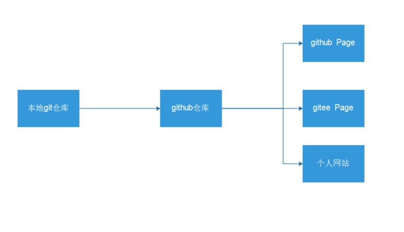
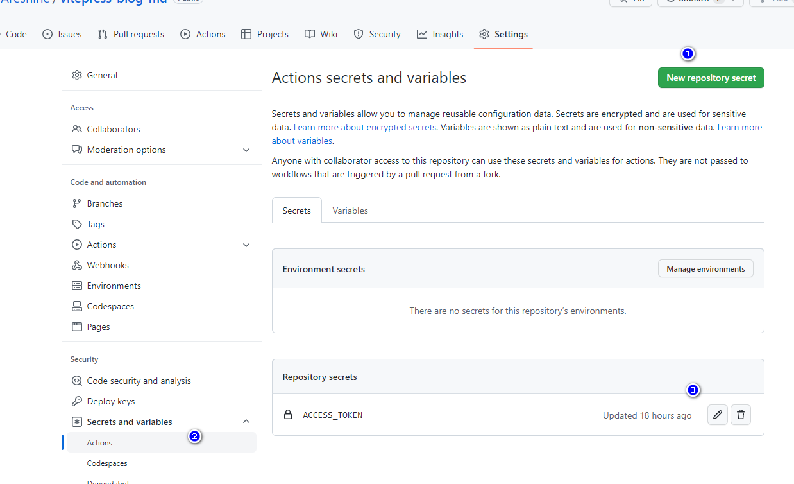

# vitepress一键搭建github、gitee和个人网站博客

> 目前只记录最核心的内容，等发布的时候再次进行编辑

> 完成效果

基于vite和vue搭建一个网站，其中包括vue的组件开发，组件可以显示在网站中。vitepress搭建md文档，文档支持md引入vue组件。项目的整体构造是




上面设置的仓库，和下面的进行对应的配置，记住名字

## github仓库

1、设置对应的环境变量



2、添加workfown，让其自动打包

```yml
name: pushDocs
on:
  push:
    branches: 
     - master
jobs:
   build-and-deploy:
    runs-on: ubuntu-latest
    strategy:
      matrix:
        node: ['lts/fermium']
    steps:
      - name: Checkout
        uses: actions/checkout@main
        with:
          ref: 'master'
          persist-credentials: false
          fetch-depth: 0
        env:
          TZ: Asia/Shanghai
      - name: Use Node.js ${{ matrix.node-version }}
        uses: actions/setup-node@main
        with:
          node-version:  ${{ matrix.node }}
      - name: Install pnpm
        run: npm install pnpm -g
      - name: Install dependencies
        run: pnpm install
      - name: Build VitePress
        run: pnpm run docs:build
      - name: Deploy to Pages
        env:
         TZ: Asia/Shanghai
        run: |
          cd docs/.vitepress/dist
          git init
          git config user.name "Aresnine"
          git config user.email "763555000@qq.com"
          git add .
          git commit -m 'Deploying to gh-pages from @ $GITHUB_SHA in $(date +"%Y年%m月%d日 %T %Z")'
         
          git push -f https://Aresnine:${{secrets.ACCESS_TOKEN }}@github.com/Aresnine/Aresnine.github.io.git master:master
          cd -

```

