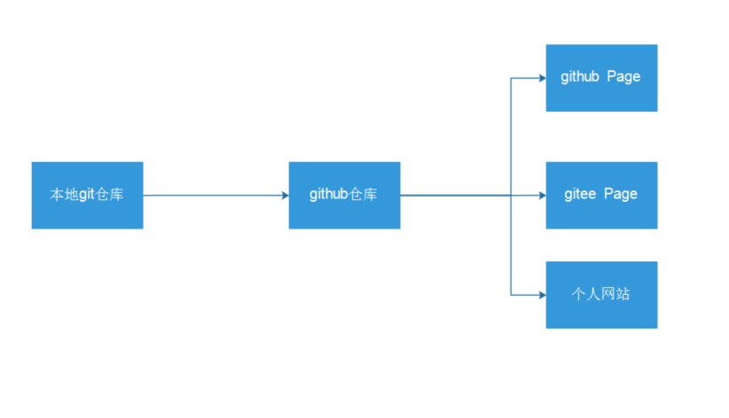
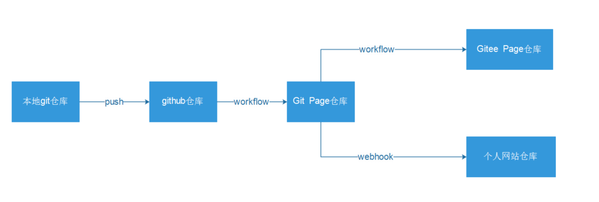
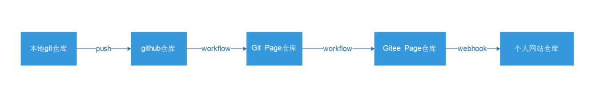
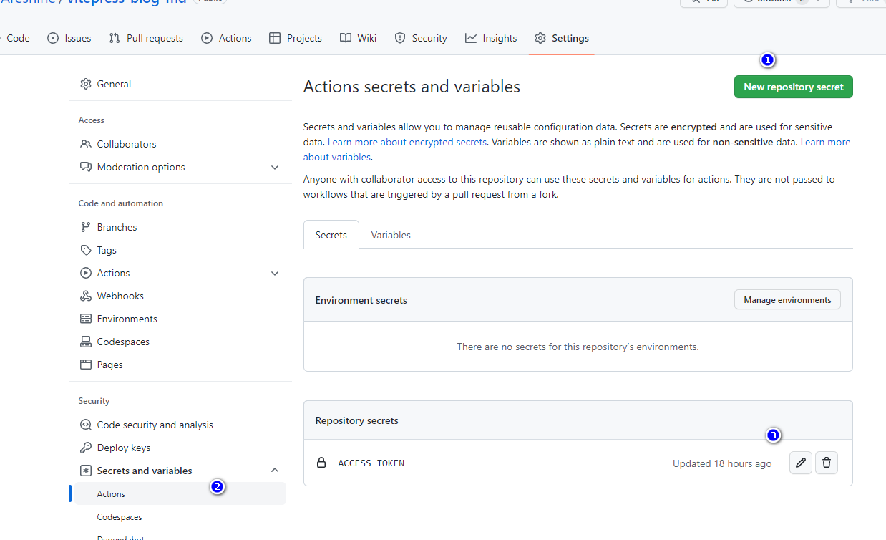

# vitepress一键搭建github、gitee和个人网站博客

> 目前只记录最核心的内容，等发布的时候再次进行编辑

> 完成效果

基于vite和vue搭建一个网站，其中包括vue的组件开发，组件可以显示在网站中。vitepress搭建md文档，文档支持md引入vue组件。项目的整体构造是


> 目标架构




> 阶段一



> 现有架构模式



上面设置的仓库，和下面的进行对应的配置，记住名字

## github仓库

1、设置对应的环境变量



2、添加workfown，让其自动打包

```yml
name: pushDocs
on:
  push:
    branches: 
     - master
jobs:
   build-and-deploy:
    runs-on: ubuntu-latest
    strategy:
      matrix:
        node: ['lts/fermium']
    steps:
      - name: Checkout
        uses: actions/checkout@main
        with:
          ref: 'master'
          persist-credentials: false
          fetch-depth: 0
        env:
          TZ: Asia/Shanghai
      - name: Use Node.js ${{ matrix.node-version }}
        uses: actions/setup-node@main
        with:
          node-version:  ${{ matrix.node }}
      - name: Install pnpm
        run: npm install pnpm -g
      - name: Install dependencies
        run: pnpm install
      - name: Build VitePress
        run: pnpm run docs:build
      - name: Deploy to Pages
        env:
         TZ: Asia/Shanghai
        run: |
          cd docs/.vitepress/dist
          git init
          git config user.name "Aresnine"
          git config user.email "763555000@qq.com"
          git add .
          git commit -m 'Deploying to gh-pages from @ $GITHUB_SHA in $(date +"%Y年%m月%d日 %T %Z")'
         
          git push -f https://Aresnine:${{secrets.ACCESS_TOKEN }}@github.com/Aresnine/Aresnine.github.io.git master:master
          cd -

```

## 个人网站

基于gitee的action和宝塔的webhook，速度很快

参考文章：

- https://www.likecs.com/show-204667970.html#sc=400
- https://blog.csdn.net/alipea/article/details/83858177

> 之前拉取gitee的webhook

```bash
#!/bin/bash
echo ""
# 输出当前时间
date --date='0 days ago' "+%Y-%m-%d %H:%M:%S"
echo "Start"
# 判断宝塔WebHook参数是否存在
if [ ! -n "$1" ];
then 
          echo "param参数错误"
          echo "End"
          exit
fi
# git项目路径
gitPath="/www/wwwroot/$1"
# git 网址
gitHttp="git@gitee.com:Aresnine/blogdist.git"
echo "Web站点路径：$gitPath"

#判断项目路径是否存在
if [ -d "$gitPath" ]; then
        cd $gitPath
        #判断是否存在git目录
        if [ ! -d ".git" ]; then
                echo "在该目录下克隆 git"
                sudo git clone $gitHttp gittemp
                sudo mv gittemp/.git .
                sudo rm -rf gittemp
        fi
        echo "拉取最新的项目文件"javascript:;
        sudo git reset --hard origin/master
        sudo git pull       
        echo "拉取结束End"
        exit
else
        echo "该项目路径不存在"
        echo "新建项目目录"
        mkdir $gitPath
        cd $gitPath
        #判断是否存在git目录
        if [ ! -d ".git" ]; then
                echo "在该目录下克隆 git"
                sudo git clone $gitHttp gittemp
                sudo mv gittemp/.git .
                sudo rm -rf gittemp
        fi
        echo "拉取最新的项目文件"
         sudo git reset --hard origin/master
        sudo git pull
        echo "设置目录权限"
        sudo chown -R www:www $gitPath
        echo "End"
        exit
fi
```


## github到gitee代码同步

这里是有镜像仓库的概念就是gitee可以每隔一段时间（最小30分钟）自动同步github的仓库。因为我们想做的是实时的所以这种方式我们果断放弃


