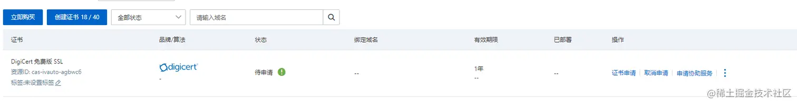

# 配置个人站点的HTTPS

::: tip
    阿里云申请SSL，宝塔Nginx配置HTTPS
:::

## 一、证书申请

### 1、阿里云整站搜索ssl

### 2、进入ssl证书，点击免费证书

### 3、点击创建证书

一个ECS应用每个人每年可以申请20个，点进去申请即可

申请完毕，点击立即创建

### 4、点击证书申请

**验证的时候可以点击验证，确保域名指向ip进行解析**

### 5、下载证书

## 二、宝塔配置

### 1、进入宝塔相关设置

### 2、将之前在阿里云下载的文件进行解压

### 3、将对应的文件打开，将key中的内容复制到第一个秘钥中，将pem中的内容复制到第二个证书中即可

### 4、访问你的域名即可，[www.yourdomain.com](https://link.juejin.cn?target=https%3A%2F%2Fwww.yourdomain.com)

