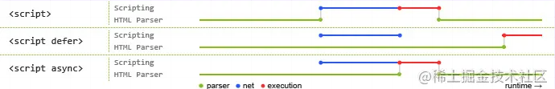

## HTML面试题

### 1、src和href的区别

href代表建立资源的引用关系，浏览器会并行下载，不会暂停其他资源的下载和处理

src代表将资源加载进来，浏览器会暂停其他资源的下载和处理

### 2、对HTML语义化的理解

语义化是根据内容的结构化（内容语义化），选择合适的标签（代码语义化）。通俗讲就是用正确的标签做正确的事情。

语义化有点：

- 有利于SEO
- 支持读屏软件，根据文章可以自动生成目录
- 便于开发和维护

### 3、script标签中defer和async的区别

如果没有defer和async属性，浏览器会立即加载并执行响应的脚本，阻塞后续文档的加载和渲染。

> 下图展示了三者的区别：



- 蓝色代表js脚本网络加载时间

- 红色代表js脚本你执行时间

- 绿色代表html解析时间

defer和async都是去异步加载js脚本文件，但是async的脚本执行是异步执行的，而defer会等到html元素解析之后再执行， `DOMContentLoaded` 事件触发之前完成 

### 4、拖放

是否可以拖拽图片 

```

```

### 5、img的srcset属性

响应式页面中经常用到根据屏幕像素密度设置不同的图片。这是就用到了img的srcset属性。

> 基础用法：

```

```

> 高级用法：

```

```

sizes必须是当srcset设置为w的时候才起作用，会根据sizes的设定选择合适的图片

### 6、HTML5的离线存储怎么使用，他的工作原理是什么

离线存储指的是：在用户没有与因特网链接时，可以正常访问站点或应用，在用户与因特网连接时，更新用户机器上的缓存文件。

原理：HTML5离线存储是基于一个新建的`.appcache`文件的缓存机制（不是存储技术）,通过这个文件上的解析清单离线存储资源，这些资源就会像cookie一样存储下来。之后当网络在处于离线状态下，浏览器会通过被离线存储的数据进行页面展示

使用方法：

1. 创建一个和`html`同名的`mainfest`文件，然后在页面的头部加入`mainfest`属性

    ```
    <html lang="en" manifest="index.manifest">
    ```

2. 在`cache.mainfest`文件中编写需要离线存储的资源

    ```
    CACHE MANIFEST
        #v0.11
        CACHE:
        js/app.js
        css/style.css
        NETWORK:
        resourse/logo.png
        FALLBACK:
        / /offline.html
    ```

    - **CACHE**: 表示需要离线存储的资源列表，由于包含 manifest 文件的页面将被自动离线存储，所以不需要把页面自身也列出来。

    - **NETWORK**: 表示在它下面列出来的资源只有在在线的情况下才能访问，他们不会被离线存储，所以在离线情况下无法使用这些资源。不过，如果在 CACHE 和 NETWORK 中有一个相同的资源，那么这个资源还是会被离线存储，也就是说 CACHE 的优先级更高。

    - **FALLBACK**: 表示如果访问第一个资源失败，那么就使用第二个资源来替换他，比如上面这个文件表示的就是如果访问根目录下任何一个资源失败了，那么就去访问 offline.html 。

3. 在离线状态时，操作`window.applicationCache`进行离线缓存的操作

如何更新缓存：

1. 更新mainfest文件
2. 通过javascript操作
3. 清除浏览器缓存

注意事项：

1.  浏览器对缓存数据的容量限制可能不太一样（某些浏览器设置的限制是每个站点 5MB）。 
2.  如果 manifest 文件，或者内部列举的某一个文件不能正常下载，整个更新过程都将失败，浏览器继续全部使用老的缓存。 
3.  引用 manifest 的 html 必须与 manifest 文件同源，在同一个域下。 
4.  FALLBACK 中的资源必须和 manifest 文件同源。 
5.  当一个资源被缓存后，该浏览器直接请求这个绝对路径也会访问缓存中的资源。 
6.  站点中的其他页面即使没有设置 manifest 属性，请求的资源如果在缓存中也从缓存中访问。 
7.  当 manifest 文件发生改变时，资源请求本身也会触发更新。 

### 7、浏览器是如何对HTML5的离线存储资源进行管理和加载？

1. **在线的情况下**，浏览器发现 html 头部有 manifest 属性，它会请求 manifest 文件，如果是第一次访问页面 ，那么浏览器就会根据 manifest 文件的内容下载相应的资源并且进行离线存储。如果已经访问过页面并且资源已经进行离线存储了，那么浏览器就会使用离线的资源加载页面，然后浏览器会对比新的 manifest 文件与旧的 manifest 文件，如果文件没有发生改变，就不做任何操作，如果文件改变了，就会重新下载文件中的资源并进行离线存储。
2. **离线的情况下**，浏览器会直接使用离线存储的资源。

### 8、iframe有哪些优点和缺点

iframe元素会创建包含另一个文档的内联框架

> 优点:

1. 用来加载速度较慢的内容（广告）
2. 可以使脚本并行下载
3. 课实现跨子域通信

> 缺点：

1. iframe会阻塞主页面的onload事件
2. 无法被搜索引擎识别
3. 会产生很多页面，不易管理

### 9、Canvas和SVG的区别

**（1）SVG：** SVG可缩放矢量图形（Scalable Vector Graphics）是基于可扩展标记语言XML描述的2D图形的语言，SVG基于XML就意味着SVG DOM中的每个元素都是可用的，可以为某个元素附加Javascript事件处理器。在 SVG 中，每个被绘制的图形均被视为对象。如果 SVG 对象的属性发生变化，那么浏览器能够自动重现图形。

其特点如下：

- 不依赖分辨率
- 支持事件处理器
- 最适合带有大型渲染区域的应用程序（比如谷歌地图）
- 复杂度高会减慢渲染速度（任何过度使用 DOM 的应用都不快）
- 不适合游戏应用

**（2）Canvas：** Canvas是画布，通过Javascript来绘制2D图形，是逐像素进行渲染的。其位置发生改变，就会重新进行绘制。

其特点如下：

- 依赖分辨率
- 不支持事件处理器
- 弱的文本渲染能力
- 能够以 .png 或 .jpg 格式保存结果图像
- 最适合图像密集型的游戏，其中的许多对象会被频繁重绘

注：矢量图，也称为面向对象的图像或绘图图像，在数学上定义为一系列由线连接的点。矢量文件中的图形元素称为对象。每个对象都是一个自成一体的实体，它具有颜色、形状、轮廓、大小和屏幕位置等属性。

### 10、渐进增强和优雅降级之间的区别

**（1）渐进增强（progressive enhancement）**：主要是针对低版本的浏览器进行页面重构，保证基本的功能情况下，再针对高级浏览器进行效果、交互等方面的改进和追加功能，以达到更好的用户体验。 

**（2）优雅降级 graceful degradation**： 一开始就构建完整的功能，然后再针对低版本的浏览器进行兼容

“优雅降级”观点认为应该针对那些最高级、最完善的浏览器来设计网站。而将那些被认为“过时”或有功能缺失的浏览器下的测试工作安排在开发周期的最后阶段，并把测试对象限定为主流浏览器（如 IE、Mozilla 等）的前一个版本。 在这种设计范例下，旧版的浏览器被认为仅能提供“简陋却无妨 (poor, but passable)” 的浏览体验。可以做一些小的调整来适应某个特定的浏览器。但由于它们并非我们所关注的焦点，因此除了修复较大的错误之外，其它的差异将被直接忽略。

“渐进增强”观点则认为应关注于内容本身。内容是建立网站的诱因，有的网站展示它，有的则收集它，有的寻求，有的操作，还有的网站甚至会包含以上的种种，但相同点是它们全都涉及到内容。这使得“渐进增强”成为一种更为合理的设计范例。这也是它立即被 Yahoo 所采纳并用以构建其“分级式浏览器支持 (Graded Browser Support)”策略的原因所在。


